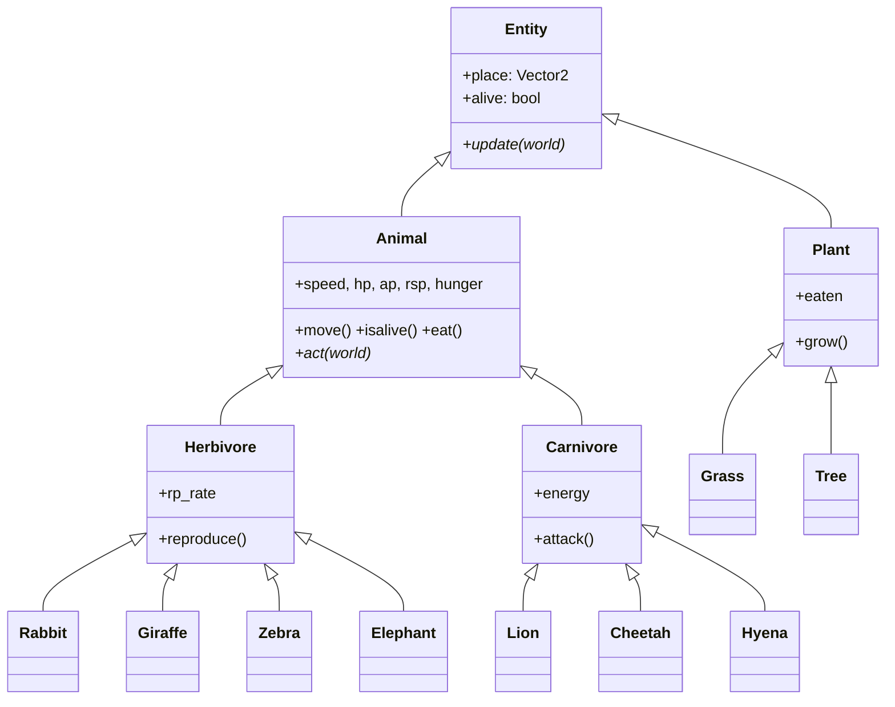
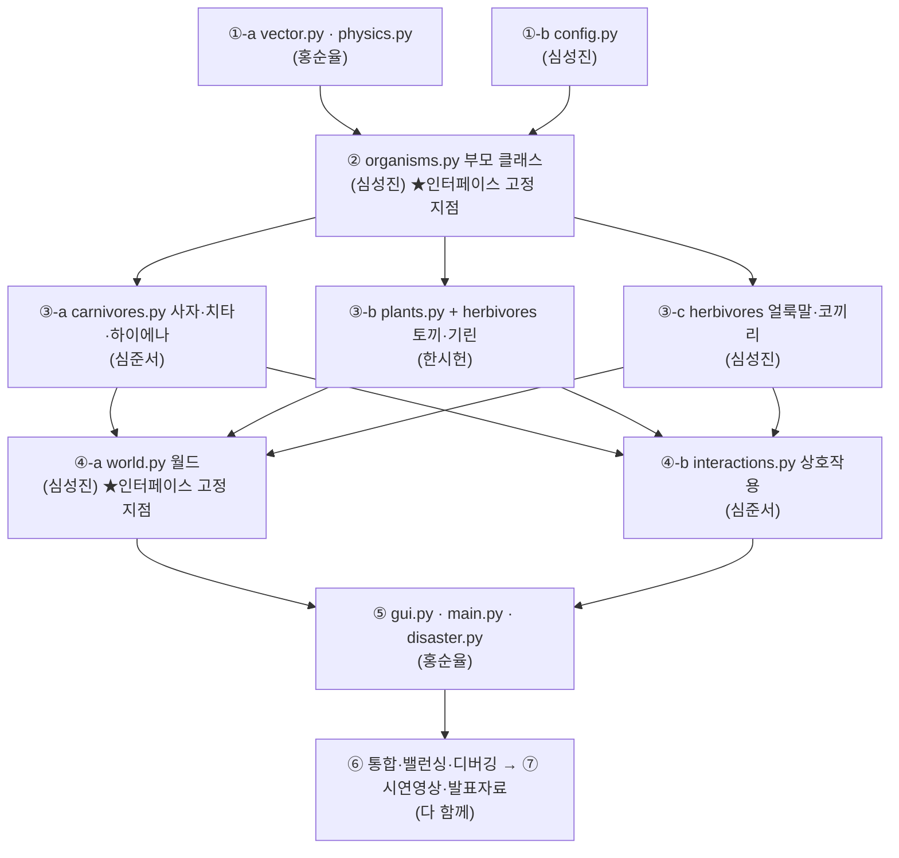

# 🦁 심심한 초원의 제왕 홍순율 — 초원 생태계 시뮬레이션

> 2026 컴퓨터과학1 프로젝트 · 조 이름 **네이처 빌더** · 주제 **초원(Savanna) 생태계**
> 객체지향 프로그래밍으로 "살아 있는 초원 생태계"를 시간의 흐름에 따라 보여 줍니다.

---

## 1. 실행 방법

```bash
python3 main.py
```

- **추가 설치가 전혀 필요 없습니다.** 파이썬 **표준 라이브러리만** 사용합니다
  (GUI = `tkinter`, 물리엔진 = 직접 구현, 그 외 `math`/`random` 등).
- 모든 코드는 **100% 파이썬**으로 작성되었습니다. (요구사항: 언어·GUI·물리엔진 모두 Python)
- 권장 환경: macOS + Python 3.9 이상 (이모지·한글 글꼴이 기본 포함).

### 조작법

| 키 | 동작 |
|----|------|
| `D` | **트랙터 재난 발생** — 초원을 밀어버리는 종료 이벤트 |
| `Space` | 일시정지 / 재개 |
| `R` | 처음부터 다시 시작 |
| `Q` / `Esc` | 종료 |

---

## 2. 파일 구조와 역할 분담

> 프로젝트 조건 7번 "코드 내 역할 분담이 확인 가능해야 함"을 위해, 각 파일 머리말과
> 클래스 위 주석에 **담당 조원**을 표기했습니다.

| 파일 | 내용 | 담당 |
|------|------|------|
| `main.py` | 프로그램 진입점 | 홍순율 |
| `gui.py` | tkinter 화면 출력·키 입력 | 홍순율 |
| `vector.py` | 2D 벡터(물리엔진 기초) | 홍순율 |
| `physics.py` | 물리엔진(이동·충돌·조향·넉백) | 홍순율 |
| `disaster.py` | 재난재해(트랙터) = 종료 조건 | 홍순율 |
| `organisms.py` | 공통 부모 클래스(Animal/Herbivore/Carnivore/Plant) | 심성진 |
| `world.py` | 생태계 월드(전체 관리·갱신 루프) | 심성진 |
| `config.py` | 전역 설정값 | 심성진 |
| `carnivores.py` | 사자·치타·하이에나 | 심준서 |
| `interactions.py` | 동물 간 전역 상호작용 | 심준서 |
| `herbivores.py` | 토끼·기린(한시헌), 얼룩말·코끼리(심성진) | 한시헌·심성진 |
| `plants.py` | 풀·나무 | 한시헌 |

---

## 3. 클래스 다이어그램 (발표 자료용)

### 상속 구조

```
Entity (엔진용 최상위 · 추상)         ← 위치/충돌/그리기 공통, 홍순율
├── Animal (animal · 추상)            ← speed, hp, ap, rsp, place, hunger / move, isalive, eat
│   ├── Herbivore (herbivores)        ← rp_rate / reproduce
│   │   ├── Rabbit   (토끼)   hide()
│   │   ├── Giraffe  (기린)   neckfight()
│   │   ├── Zebra    (얼룩말)  distract()
│   │   └── Elephant (코끼리)  stomp(), tree()
│   └── Carnivore (carnivores)        ← energy / attack
│       ├── Lion    (사자)   roar()
│       ├── Cheetah (치타)   boost()
│       └── Hyena   (하이에나) steal()
└── Plant (plant)                      ← eaten / grow
    ├── Grass (풀)   rab_num, be_eaten()
    └── Tree  (나무)  BREED_RADIUS
```

> `Entity`는 계획서에는 없지만, 물리엔진·렌더링이 동물과 식물을 동일하게 다루기 위해
> 추가한 엔진용 최상위 부모입니다. 그 아래 `Animal`/`Plant`가 계획서의 부모 클래스입니다.

### Mermaid (GitHub/발표 도구에서 렌더링)



---

## 4. 동물 간 상호작용 (계획서 대응)

| # | 상호작용 | 구현 위치 |
|---|----------|-----------|
| ① | 얼룩말·토끼가 풀을 먹음(hp 가득 차면 중단) | `interactions.feed_herbivores` |
| ② | 사자·치타가 가까운 얼룩말·토끼를 추격해 잡아먹음 | `Carnivore._carnivore_behavior` + `interactions.resolve_predation` |
| ③ | 기린이 넥스윙으로 포식자를 밀쳐내고 피해를 줌(쿨타임이면 역으로 공격당함) | `Giraffe.neckfight` |
| ④ | 코끼리가 stomp(기절)·tree(투척)로 방어, 쿨타임이면 공격당함 | `Elephant.stomp/tree` |
| ⑤ | 기린끼리 가까우면 확률적으로 싸움 | `interactions.giraffe_fights` |
| ⑥ | 하이에나가 사냥 중인 먹이로 달려가 확률적으로 가로챔 | `Hyena.act` + `interactions._award_kill` |
| ⑦ | 코끼리가 근처 나무를 뽑아 포식자에 투척 | `Elephant.tree` |
| ⑧ | 모든 동물이 나무 근처에서 만나면 번식 | `interactions.reproduce_near_trees` |
| 종료 | 사용자가 `D`를 누르면 트랙터가 초원을 완전히 밀어버림 | `disaster.py` + `World.trigger_disaster` |

추가 능력: 사자 `roar()`(광역 둔화), 치타 `boost()`(가속), 토끼 `hide()`(은신),
얼룩말 `distract()`(교란) — 모두 계획서의 고유 메서드입니다.

---

## 5. 종료 조건 (프로젝트 조건 6번)

- **트랙터 재난(`D` 키)**: 거대한 트랙터 무리가 왼쪽에서 등장해 오른쪽으로 진격하며
  닿는 모든 동·식물을 밀어버립니다. 초원을 완전히 통과하면 시뮬레이션이 끝납니다.
- **자연 붕괴**: 재난 없이도 모든 동물이 사라지면 생태계가 종료됩니다.

---

## 6. 생성형 AI 활용 명시 (안내 자료 유의사항)

본 프로젝트는 계획서의 "생성형 AI 활용 계획"에 따라, **GUI·물리엔진 등 익숙하지 않은
부분을 중심으로 생성형 AI(Claude)의 도움**을 받아 구현했습니다. 도움을 받은 부분은
각 파일 머리말 주석에 `[생성형 AI 활용]`로 명시했습니다. 핵심 설계 의도와 동작 원리는
주석(한국어)으로 정리되어 있어 발표 시 설명할 수 있습니다.

---

## 7. 구현 메모 (계획서와의 차이 · 밸런스 결정)

발표/질의에 대비해, 계획서 원안과 달라진 점과 그 이유를 정리합니다.

- **번식 조건 완화 (멸종 방지)**: 상호작용⑧은 "나무 근처에서 만나면 번식"입니다. 같은 종 2마리
  이상이 나무 `BREED_RADIUS` 안에 모이고 **그중 한 마리라도 번식 준비(초식: 게이지 100,
  육식: energy ≥ 75)** 가 되면 곁의 짝과 새끼가 태어납니다. "둘 다 준비"를 요구하면 개체 수가
  적은 종이 사실상 번식하지 못해 멸종하므로 의도적으로 완화했습니다. (`interactions.reproduce_near_trees`)
- **육식동물 `reproduce()` 확장**: 계획서 클래스표에는 `reproduce()`가 초식에만 있으나,
  상호작용표는 "**모든** 동물이 번식"이라 규정하므로 육식동물에도 `reproduce()`를 추가했습니다.
- **포식자는 배고플 때만 사냥**: 포식자가 늘 사냥하면 먹이가 회복할 틈 없이 전멸합니다. 실제 사자처럼
  허기≥35에서만 추격하고 평소엔 쉬게 해, 개체 수가 오르내리는 자연스러운 균형을 만들었습니다.
- **사자 포효(roar)는 양날의 검**: 동족·동료 포식자까지 둔화됩니다(의도된 trade-off, 주석에 명시).
- **나무 자연 재생**: 코끼리가 나무를 뽑아 던지면 번식터가 사라져 생태계가 무너지므로, 일정 주기로
  나무가 최소 개체 수까지 다시 자랍니다. (`World._regrow_trees`)
- **번식터 군집 완화**: 배가 고프지 않은 모든 초식동물이 처음부터 나무로 몰리면 번식 장면이 한곳에
  뭉쳐 보입니다. 이제 번식 준비도가 충분히 찬 개체만 나무로 향하고, 가까운 나무 여러 개 중 덜 붐비는
  곳을 고르며, 나무 중심이 아니라 둘레의 각자 자리로 이동합니다. 출산 직후 부모와 새끼는 잠깐 흩어져
  사냥·도망·먹이 찾기 같은 다른 상호작용도 화면에 잘 보입니다. (`organisms._forage_and_gather`,
  `interactions.reproduce_near_trees`)
- **계획서 외 추가 속성**: 코끼리 `stomp_rate`(밟기 쿨타임)는 밸런스 조절을 위해 추가한 항목입니다.
- **글꼴**: macOS 기본 글꼴(AppleGothic / Apple Color Emoji)을 우선 사용하되, 다른 OS에서는
  설치된 한글·이모지 글꼴을 자동으로 찾아 대체합니다. (`gui._pick_font`) 권장 환경은 macOS입니다.

---

## 8. 개발 순서 (역할별 작업 순서)

> "누가 무엇부터 시작하고, 누가 끝나면 누가 시작하는지"를 **의존성(dependency)** 기준으로 정리했습니다.
> 핵심 원칙: **부모 클래스와 World의 '인터페이스(이름·시그니처)'를 먼저 고정**해야, 나머지를
> 여러 명이 동시에 병렬로 만들 수 있습니다. (이름이 정해져야 서로를 호출할 수 있기 때문)

### 의존성 그래프



### 단계별 순서

| 단계 | 작업 / 파일 | 담당 | 시작 조건 (선행) |
|------|------------|------|------------------|
| **0** | 계획서대로 **클래스 구조·속성·메서드 이름·상호작용 규칙 합의** | 다 함께 | (가장 먼저) |
| **①-a** | `vector.py` → `physics.py` (물리엔진) | 홍순율 | 의존성 없음 — 0단계 직후 바로 |
| **①-b** | `config.py` (전역 상수) | 심성진 | 의존성 없음 — ①-a와 동시 |
| **②** | `organisms.py` (Entity·Animal·Herbivore·Carnivore·Plant 부모) | 심성진 | ①이 어느 정도 되면. **여기서 부모의 속성/메서드(act·update 등) 이름을 고정** |
| **③-a** | `carnivores.py` (사자·치타·하이에나) | 심준서 | ②(부모 인터페이스) 고정 후 |
| **③-b** | `plants.py` + `herbivores.py`의 토끼·기린 | 한시헌 | ② 고정 후 (③-a, ③-c와 **동시 병렬**) |
| **③-c** | `herbivores.py`의 얼룩말·코끼리 | 심성진 | ② 고정 후 (한시헌과 같은 파일이라 합칠 때 조율) |
| **④-a** | `world.py` (월드·갱신 루프·nearest/within) | 심성진 | ③ 동물들이 어느 정도 나오면. **여기서 World 인터페이스(step·nearest·within·spawn·log) 고정** |
| **④-b** | `interactions.py` (전역 상호작용) | 심준서 | ③ 동물 + ④-a의 nearest/within 의존 (인터페이스 합의되면 ④-a와 병렬) |
| **⑤** | `gui.py` · `main.py` · `disaster.py` (화면·입력·종료) | 홍순율 | ④(World 인터페이스) 고정 후 |
| **⑥** | 통합 · 밸런싱(개체수/능력 조정) · 디버깅 | 다 함께 | ⑤까지 합쳐지면 (12~13주차) |
| **⑦** | 시연영상(2분) · 발표자료(클래스 다이어그램) · 코드 제출 | 다 함께 | ⑥ 완료 후 (14주차) |

### 한눈에 보는 흐름
1. **홍순율**(`vector`/`physics`)과 **심성진**(`config`)이 **동시에** 시작 →
2. 이게 되면 **심성진**이 부모 클래스(`organisms`)를 만들어 **인터페이스를 고정** →
3. 고정되는 즉시 **심준서**(육식)·**한시헌**(토끼/기린/식물)·**심성진**(얼룩말/코끼리)이 **셋이 동시에** 동물 클래스 작성 →
4. 동물이 나오면 **심성진**(`world`)·**심준서**(`interactions`)가 월드·상호작용 작성(World 인터페이스 합의 후 병렬) →
5. World가 되면 **홍순율**이 `gui`/`main`/`disaster`로 화면·종료 구현 →
6. **다 함께** 합쳐서 밸런싱·디버깅 → 시연영상·발표자료 제작.

> 💡 병목은 **② 부모 클래스**와 **④ World**입니다. 이 둘의 "이름(인터페이스)"만 먼저 합의해 두면
> (속 내용은 비어 있어도) 나머지 팀원이 기다리지 않고 병렬로 개발할 수 있습니다.

---

## 9. 저장소 자동 동기화

이 저장소(`SSHSProject/-1-`, `main` 브랜치)는 관리자(홍순율) 작업 환경에서 **파일이 수정될 때마다
자동으로 커밋·푸시**되도록 설정되어 있습니다(macOS `launchd` 백그라운드 동기화). 따라서 별도
조작 없이도 최신 코드가 GitHub에 반영됩니다. 자동 커밋 메시지는 `자동 동기화 <시간>` 형식입니다.
